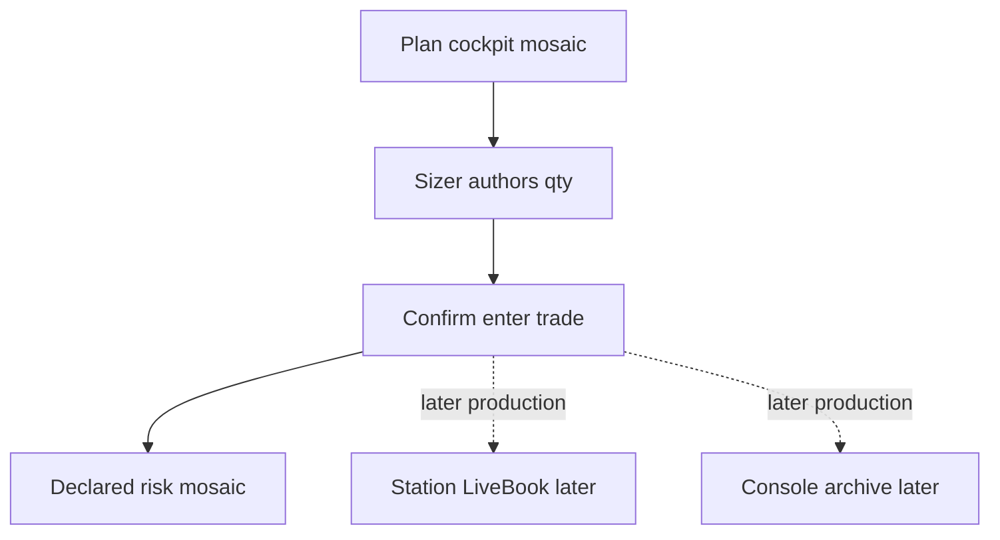

# Plan: Harness remaining (Plan cockpit → risk after Confirm)

> Source: handoff `/tmp/tradeautopsy-notch-risk-prototype-handoff-2026-09-18.md` + grill 2026-09-18 + [plans/station-completion-roadmap-2026-09-17.md](station-completion-roadmap-2026-09-17.md).
> Prototype host: [station/prototypes/PROTOTYPE-notch-options-dashboard.html](../station/prototypes/PROTOTYPE-notch-options-dashboard.html) (`?asset=options&board=cockpit`).

**Status:** Phase P0 (throwaway HTML) is the current gate. Production phases below are **blocked** until the risk host is founder-signed and a primary-sourced `docs/reference/` doc exists for sizing / R:R policy. Do not publish a `ready-for-agent` epic until then.

---

## Architectural decisions

- **Surface:** Planning stays on the **cockpit mosaic**. Risk mosaic appears **only after Confirm — enter trade**. Back to plan restores the cockpit. Do not put at-stop / at-target tiles on the planning board.
- **Declared board:** both outcomes on the **same authored qty** (DualNoBlend): stop → money + %; take profit → signed money + %. Equity path down (red) / up (green). Demo lock: options buy qty 3, entry 412.80, SL 380, TP 448 → −98.40 USDT (0.98%) vs +105.60 USDT (1.06%), ~1.07R.
- **Sizer:** authors qty on Plan (`equity × role risk / |entry−stop|`). Gate binds. No stop → do not invent one. Option seller measurement **dark**. Override above authored → Confirm blocked.
- **Layout zoo:** [PROTOTYPE-notch-risk-engine.html](../station/prototypes/PROTOTYPE-notch-risk-engine.html) is A/B/C SL-only comparison. Not the product flow. Do not merge into the host.
- **Production overlay name (later):** Harness. Screens: Open / Plan / Working / Debrief.
- **Open (later):** morning-brief B header + D gate.
- **LiveBook N1 (later):** Station-first mutate; Console POST is archive. T9 parked.
- **UBI:** read-only. No `routeOrder`. No Set SL on Plan. No Station margin engine. σ 2–5 stay dark. Black-76 / PCR / max pain / OpenAlgo wrap stay out.
- **Tickets (later):** one GitHub **epic** (never `ready-for-agent`). Rust children: `ready-for-agent`. Swift: `ready-for-human` + `needs-macos`.

---

## Phase P0: Throwaway host (current)

**User stories:** Plan on cockpit; risk after Confirm; dual-outcome mosaic; R-multiple; wrong-side TP warning; seller-dark.

### What to build

Stay on the dashboard HTML host. No Swift.

### Acceptance criteria

- [x] Plan board has no at-stop / at-target / equity-path tiles
- [x] Confirm flips to dual-outcome mosaic; Back to plan restores cockpit
- [x] DualNoBlend; seller Confirm blocked + measurement dark; wrong-side TP warns
- [x] R-multiple on declared TP path
- [x] Layout zoo stays SL-only (separate file)
- [x] No Swift / no `docs/reference/` from memory / no unrelated commits

---

## Phase 0: Founder dogfood checklist (parallel, human)

**User stories:** rebuild Station; sign Kotak funds + positionbook; scoped S8 glance + last.

### What to build

GitHub issue `ready-for-human` + `needs-macos` pointing at [kotak-dogfood-2026-09-18.md](kotak-dogfood-2026-09-18.md). Not part of the Harness epic PRD.

### Acceptance criteria

- [x] S6-FO signed 2026-09-19 — [kotak-dogfood-2026-09-18.md](kotak-dogfood-2026-09-18.md) (`a4f60a0` funds + positionbook)
- [x] Scoped S8 signed 2026-09-19 — [s8-scoped-dogfood-2026-09-19.md](s8-scoped-dogfood-2026-09-19.md) (Quote **unknown**, last paints, History on options book)
- [ ] GitHub `ready-for-human` issue (optional tracker; dogfood does not wait on it)

---

## Phase 1: LiveBook mutate (N1) — code on disk; founder dogfood left

**User stories:** declare/cancel/protective/fill survive refresh; overlay reads Station; 2s poll gone; no 45s fake armed.

### What to build

Event application on Station LiveBook. Overlay hydrates once, then follows events. Declare still archives to Console. Preceded by a throwaway LiveBook **logic** HTML prototype.

### Acceptance criteria

- [x] `LiveBook::apply` — declare / cancel / protective / fill (no PnL)
- [x] Declare apply-first; Console 5xx keeps pending + `archive_error`
- [x] Cancel 2xx/5xx clears pending; 409 leaves it
- [x] No 2s live-state poll spine (extract on PLAN expand + after command)
- [x] 45s optimistic armed / “check web Bar” no longer un-arms
- [ ] Founder dogfood: Confirm stays after refresh; cancel clears it

---

## Phase 2: Wave 1 desk honesty — blocked

**User stories:** session clock per book; collapsed pill in real book currency; exposure dark until real notional; cull demo; Kill chrome; Harness rename.

### Acceptance criteria

- [ ] COM 24/7; NSE hours on cash/NFO; no USD painted as INR
- [ ] Exposure not qty×1000
- [ ] No “check web Bar”
- [ ] Demo series gone from Open/Process/Setups chrome

---

## Phase 3: Production Plan cockpit + post-Confirm risk — blocked

**User stories:** ship the signed HTML flow in Swift Harness; sizer + gate; dual-outcome declared board.

### Acceptance criteria

- [ ] Spot / Equity / Options boards; DualNoBlend; Plan dock cannot be removed
- [ ] Risk tiles only after Confirm
- [ ] Size dashed when funds dark or invalidation missing
- [ ] Reference doc exists before any formula beyond the cited prototype identity
- [ ] σ 2–5 and margin remain dark/unavailable

---

## Phase 4: N2 journal lander + N3 — blocked

**User stories:** Plan + Working + Debrief = one object on current-date journal; sliders, setup/invalidation/tags, mistakes + upvote on Harness/week rail.

### Acceptance criteria

- [ ] Three overlay tabs do not forget each other
- [ ] Day sheet shows the same object
- [ ] No second Station tag store
- [ ] No fog psychology page

---

## Phase 5: Open B+D, derived Setups/Process/Book, week → one rule — blocked

### Acceptance criteria

- [ ] Open has no demo P&L chart
- [ ] Setups/Process not demo percentages
- [ ] Book list from fill inventory, no flatten CTA

---

## Phase 6: Later children (specified, blocked)

Kill lifetime latch; Health H2 if still wanted. S8 account chrome / Console S8 / T9 are **not** created as `ready-for-agent`.

---

## Out of scope

- Data leftovers R0 / S1 / S2 / S6 options `userTrades` (unless an adapter touch forces R0)
- Venue place / move / cancel / flatten (new ADR)
- Kelly / fixed-fraction invented into `docs/reference/` from memory
- Hygiene commits of unrelated dirty files
