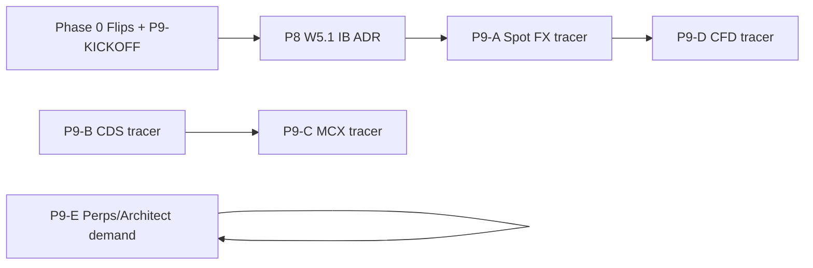

# Plan: Multi-asset territories — spot FX, CDS, MCX/NCDEX, CFD, FX perps / Architect

> Source: founder ask 2026-09-24 · [FULL-COVERAGE-PROGRAM.md](/Users/bishnu/issues/brokers/FULL-COVERAGE-PROGRAM.md) P8–P9 · [CLAIM-REGISTRY.md](/Users/bishnu/issues/compliance/CLAIM-REGISTRY.md) · ticket contract Appendix A–C  
> **Status:** ACTIVE — Phase 0 landed 2026-09-24; see [P9-KICKOFF.md](/Users/bishnu/issues/brokers/P9-KICKOFF.md)  
> **Goal:** End-to-end **one book at a time**, maximum reuse of Wave 2/3/P6 lanes; **no** global “enable forex/commodity.”

---

## Architectural decisions (fixed for all slices)

- **Book ≠ slug.** Every live path is `book_id` → `(asset_class, instrument_class, is_inverse)` → fence → calc profile → **one** PnL owner.
- **No new asset class strings.** Wire uses ADR 0004 only: `fx`, `commodity`, `equity`, `debt`, `cryptocurrency`, `alternative` + `spot` / `future` / `option` / `cfd` / `swap` as stamped.
- **Registry before catalog Enabled.** N-A / REFERENCE must flip to **SHIPPING** in `CLAIM-REGISTRY.md` before B5 adapter work (CDS, MCX claim rows).
- **Tier I while building.** New slugs/books stay **Planned** + Connect/dogfood ladder ([ADR 0019](/Users/bishnu/tradeautopsy-station/docs/adr/0019-broker-launch-validation-ladder.md)) until step 6 signed → **Enabled**.
- **Serial integrator, parallel slugs.** Same as P3: one batched PR per wave-slice for `catalog.rs`, `components.rs`, `allowlist.rs`, `dns_block.rs`, `CLAIM-REGISTRY.md`, `b6_sheet_lint.rs`; parallel tickets on **distinct** books only (width ≤ 8).
- **Tracer then replicate.** Each territory ships **exactly one** end-to-end tracer book, dogfood template frozen, then copy per broker (P6/CDS pattern, P3/cash pattern).

---

## Friction killers (apply once, reuse everywhere)

| Lever | What to do |
|--------|------------|
| **One kickoff doc** | File `issues/brokers/P9-KICKOFF.md` mirroring P3: ADR index pre-assigned, territory order, parked rows. |
| **One founder sitting** | Close **Flip table** (below) in one edit to `FULL-COVERAGE-PROGRAM.md` + `CLAIM-REGISTRY.md` — avoids stop/start per territory. |
| **Calc profile families** | Add profiles only when a lock names quoting/settlement: `fx_spot_usd`, `fx_cds_inr`, `commodity_inr_mcx`, `cfd_gbp_ib` (names illustrative — lock wins). |
| **Lot/tick pipeline** | Extend NFO lot provenance pattern to **MCX/NCDEX** once; CDS uses currency contract specs, not equity lot file. |
| **Money before Enabled** | B6 gate unchanged: no **Enabled** without B6 money owner or explicit documented **none** (options-style). |
| **Dogfood template** | Copy `plans/dogfood-*-2026-09-24.md` → one template per **instrument family** (FX spot, CDS, comm future, CFD). |
| **IB once** | P8 **W5.1 ADR** unblocks US equity **and** spot FX **and** many CFD books on one slug — do not start spot FX on a second transport. |

---

## Prerequisites (do not skip — reduces rework)

| # | Gate | Why |
|---|------|-----|
| 1 | **P5 money matrix** honest for all current SHIPPING books | New owners must not collide with spot WAC / NFO engine routing. |
| 2 | **Wave 2 India cash** Tier II for at least **one** slug (dogfood signed) | Proves Connect + sync ladder before CDS/MCX on same brokers. |
| 3 | **P6 NFO tracer** (Zerodha or Kotak) **Planned + fence-green** minimum | CDS/MCX replication copies NFO book + session clock discipline. |
| 4 | **P8 W5.1 ADR accepted** | Required before **any** spot FX or US/CFD IB book (transport + threat model). |

---

## Founder flip table (Phase 0 — record before first ticket)

Edit registry + program when approving this plan:

| Territory | Registry today | Flip to | First tracer (default) | Phase |
|-----------|----------------|---------|-------------------------|--------|
| India **CDS** | N-A | BUILD + SHIPPING row | `kotak-nse-cds` on `kotak_neo` | P9-B |
| **MCX** | REFERENCE | SHIPPING per book | `kotak-mcx-future` (one commodity root) | P9-C |
| **NCDEX** | REFERENCE | SHIPPING (new claim row) | TBD after MCX tracer green | P9-C2 |
| **Spot forex** | REFERENCE | SHIPPING | `ib-fx-spot` (one pair named in lock) | P9-A |
| **CFD** (GBR/SGP) | REFERENCE | SHIPPING | `ib-cfd-gbp` or explicit MT5 path | P9-D |
| **FX perps / Architect** | Parked / demand | Named demand + unpark | BitMEX or Architect book per demand doc | P9-E |
| **Tokenized** (Kraken etc.) | REFERENCE | Spike ADR first | Refuse or sub-book — founder names | P9-F |

**MT5 CFDs:** Stay **parked** until scope ADR (terminal export vs REST vs MetaApi vs N-A). Do not parallel IB and MT5 first books.

---

## ADR index — P9 slice (see [P9-KICKOFF.md](/Users/bishnu/issues/brokers/P9-KICKOFF.md); **0015–0019 taken** by P4 crypto + ladder)

| ADR | Topic | Blocks |
|-----|--------|--------|
| **0020** | IB transport W5.1 | P9-A, P9-D, US equity |
| **0021** | Spot FX calc pip/lot/swap | First `fx` + `spot` book |
| **0022** | India CDS segment/session/charges | P9-B |
| **0023** | MCX lot/tick pipeline | P9-C |
| **0024–0028** | NCDEX, CFD, MT5/Architect/tokenized (parked) | P9-C2–F |

---

## Execution order (tracer bullets — each is E2E verifiable)



**Recommended serial order:** Phase 0 → P8 (0015) → **P9-A** (spot FX) **or** **P9-B** (CDS) if India-first — pick **one**; do not run two first-book transports in parallel.

---

## Phase 0: Law + flips + kickoff

**User stories:** All categories — unlocks registry and ADR numbers.

### What to build

- `issues/brokers/P9-KICKOFF.md` (ADR table above, tracer defaults, replication waves).
- Founder signs flip table → update `CLAIM-REGISTRY.md` + program §P9 table dates.
- Empty **calc profile stubs** forbidden — profiles land **with** first lock only.

### Acceptance criteria

- [ ] Every territory in flip table has **date + founder name** or stays explicitly **parked**
- [ ] No adapter PR merged with territory still **N-A** (CDS) without flip
- [ ] P9-KICKOFF linked from `FULL-COVERAGE-PROGRAM.md` Phase 9 header

---

## Phase P8 (bridge): IB transport — **0015**

**User stories:** Spot forex (cat 9), US equity (cat 8), IB CFDs (cat 11).

### What to build

- ADR **0015** accepted: chosen transport, refused options documented, Kill/egress posture.
- B6 stub or full sheet for `interactive_brokers` (first book scope only — not multi-asset sheet sprawl).

### Acceptance criteria

- [ ] ADR 0015 **ACCEPTED**
- [ ] Threat review + host-side session design recorded
- [ ] No Wasm until B6 row 22 hosts are cited

---

## Phase P9-A: Spot forex — **one** book E2E

**User stories:** Category 9.

**Default tracer:** `book_id` TBD in lock (e.g. major pair on IB); `asset_class=fx`, `instrument_class=spot`.

### End-to-end checklist (copy per ticket)

| Step | Gate | Deliverable |
|------|------|-------------|
| 1 | Spike | Named broker + jurisdiction + **one** pair in kickoff (not “EURUSD globally”) |
| 2 | B0–B1 | B6 `SIGNED` for slug; quote/settlement row |
| 3 | B2 | ADR **0016** + `locks/<book>.md` (pip, lot, swap/Rollover if display-only) |
| 4 | Registry | SHIPPING row |
| 5 | B3–B4 | Integrator: catalog **Planned**, allowlist, Kill, session |
| 6 | B5 | Adapter + fixtures + component test |
| 7 | B6 | `fx_*_realized_pnl.rs` + charges vs lock; Today routing by book |
| 8 | B7 | Swift Connect (reuse IB family when exists), dogfood plan, Tier I → Tier II |
| 9 | Replicate | **Do not** until tracer dogfood signed |

### Acceptance criteria

- [ ] Fills stamp `fx` + `spot`; no INR cash WAC path
- [ ] B1→B7 green; **Enabled** only after signed dogfood
- [ ] Reference doc under `docs/reference/` (D4.1-style) for REST/report shape

---

## Phase P9-B: India CDS — tracer then ~24 books

**User stories:** Category 3.

**Default tracer:** `kotak-nse-cds` (reuse `kotak_neo` auth); flip CDS from **N-A** first.

### End-to-end checklist

| Step | Deliverable |
|------|-------------|
| Flip | CDS **N-A → BUILD** in registry |
| ADR **0017** | Segment codes, session (likely NSE CD hours), charge rows |
| Lock | Official NSE/CDS fee pages dated |
| Calc | `fx_cds_inr` or dedicated `cds_inr` profile (lock names id) |
| Adapter | Currency derivative fills; refuse cash/NFO segment bleed |
| Money | One owner; statutory rates in CI |
| Replicate | Per-slug tickets after Kotak dogfood — same as P6 NFO wave |

### Acceptance criteria

- [ ] Tracer book dogfood signed
- [ ] Cash books still refuse CDS segment end-to-end (adapter + host)
- [ ] Replication ticket template copied from P6-NFO checklist

---

## Phase P9-C: MCX — tracer then NCDEX

**User stories:** Category 4.

**Default tracer:** one MCX futures root on Kotak or Zerodha (slug with SHIPPING auth).

### End-to-end checklist

| Step | Deliverable |
|------|-------------|
| ADR **0020** | Lot/tick from **venue master** (never `fo_mktlots.csv` fiction) |
| Lock | MCX contract spec + broker product map |
| Catalog | `asset_class=commodity`, `instrument_class=future` (or option later) |
| Pipeline | Shared `commodity_lot_*` read path used in tests |
| Session | MCX hours; no NSE cash clock on comm book |
| Replicate | Per-broker books; then **P9-C2** NCDEX claim row + ADR **0021** |

### Acceptance criteria

- [ ] Lot provenance asserted in golden tests
- [ ] Tracer dogfood signed before second broker
- [ ] NCDEX does not start until MCX tracer green

---

## Phase P9-D: CFD — one jurisdiction E2E

**User stories:** Category 11.

**Path A (default):** IB CFD via **0015** transport + ADR **0022**.  
**Path B:** MT5 only after ADR **0023** + explicit founder scope.

### End-to-end checklist

| Step | Deliverable |
|------|-------------|
| Lock | FCA or MAS charge/funding/leverage rows |
| Instrument | `instrument_class=cfd`; engine decision vs FX documented in ADR 0022 |
| Money | Overnight funding display rules; no spot WAC |
| Refuse | Share dealing vs CFD sibling hosts fenced |

### Acceptance criteria

- [ ] One jurisdiction, one book, B1→B7 green
- [ ] No profile sharing with USD crypto or INR cash

---

## Phase P9-E / P9-F: FX perps, Architect, tokenized

**User stories:** Categories 10, 12, tokenized (cat 8 residue).

### Rule

**No ticket until:** founder **demand doc** + unpark row + per-book lock (BitMEX, Architect, Kraken tokenized spike **0025**).

### E2E (when unparked)

Same B1→B7; **named book only**; funding/liquidation = `lossy_event_observation` unless lock names income API; never blended “FX perps class.”

---

## Replication waves (after each tracer)

| Territory | Wave pattern | Integrator batch |
|-----------|--------------|------------------|
| CDS | ~24 slugs | One wave-slice per 5–7 slugs (distinct sheets) |
| MCX | ~26 + NCDEX | Shape families if XTS/Noren — else per slug |
| Spot FX | Other IB pairs / rare second broker | New **book** per pair, same slug |
| CFD | IB regions / MT5 brokers | Jurisdiction lock first, then slug |

Each replication ticket: **Appendix A ticket contract** unchanged; re-enter at **B2** for second book on same slug.

---

## Verification (standing commands)

```bash
cd /Users/bishnu/tradeautopsy-station/agent
cargo test --lib b6_gate
cargo test --test b6_sheet_lint
cargo test --lib dns_block
# Per slug after B5:
cargo build -p ubi-<slug>-adapter --target wasm32-wasip2
cargo test --test ubi_<slug>_<book>_component
```

---

## Out of scope (explicit)

- Enabling `fx` / `commodity` in UI without a book row
- OpenAlgo / Nautilus runtime
- Binance.US, blended crypto perps class
- MT5 + IB CFD tracers in parallel
- **Enabled** flip from offline G7 without step 6 when live account exists

---

## Founder decisions needed to start Phase 0

1. **India-first vs IB-first** after prerequisites: P9-B (CDS) or P9-A (spot FX)?  
2. **MCX tracer slug:** Kotak vs Zerodha?  
3. **CFD path A vs B:** IB-only vs MT5 ADR?  
4. **Architect / FX perps:** stay parked until named book + date?

When approved, mark this plan **ACTIVE**, file `P9-KICKOFF.md`, and execute Phase 0 flips in one registry PR.
