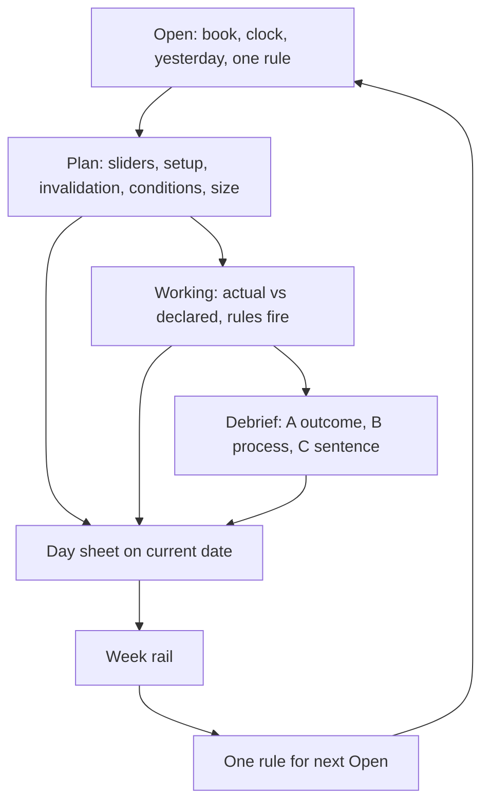

# Station completion roadmap

A realigned build order for TradeAutopsy Station. Dated 17 September 2026. This file is the sequencing authority for the remaining work named in this session. It does not reopen Data R0–S6, A8, or the cash/spot money owners.

**One job.** Make the desk honest, then make the session useful, then make risk a system. Do not restore fog. Do not paint demo as live.

---

# How to use this plan

Work waves in order. Each wave is a thin vertical slice you can dogfood on this Mac. One agent session equals one slice, not the whole PDF.

**Current gate (do this first):** S7 vendor runtime + Health + quotas + vendor UI. Then a *scoped* S8: Notch obtain glance and C1 last units on crypto Options. Console S8 and Notch *account chrome* stay out.

**Then:** unfreeze LiveBook, rename the overlay into trading language, ship Pre / Live / Post as one journal object, then size and R:R, then patterns / fidelity / triage as *derived* facts.

If a later idea fights a lock in this document, the lock wins.

---

# Where we actually are

```text
DATA     R0 ◐  S0–S2 ✔  S3 ◐ leftover  S4 ✔  S5 ✔  S6 ◐ leftover  S7 ○  S8 ◐ scoped
BUILD    T0–T3 ✔  T4 partial  T5 ◐ PLAN Kill  T6′ pending  T7–T11 later
NOTCH    PLAN host ✔  declare POST ✔  LiveBook freeze ✗  journal lander OPEN
CONSOLE  C1–C3 cull landed  /api/bar/v1 still hosted  S8 unproven
```

## What is left on the data spine

| Stage | Status | What is still owed |
|---|---|---|
| S6 leftover | Founder, not code | Kotak TOTP remint, then live cash holdings / positions / obtain(funds) / orders |
| S3 leftover | Weekday dogfood | NFO + options depth together in session; one COM gap → Unusable; cash ladder; glance 20 rows |
| **S7** | **Current build** | pick_route on obtain, per-vendor quota, Health rows, vendor UI, one live India history obtain, one labs type |
| **S8 scoped** | **After S7** | Notch obtain glance + C1 last on crypto Options chrome. Not account pulse/ledger. Not Console waterfalls |
| S8 account chrome | **Out** | Settings → Broker pulse + ledger (`plans/s8-account-chrome.md`) stays parked |
| Console S8 | **Out** | Pointing Console at extracts is unproven. Do not start it to close this gate |

## What is left on the overlay (today called Notch)

The overlay can POST a declaration. Confirm often vanishes. Live PLAN is a boot snapshot. Collapsed P&L is the USD hero painted as desk currency. Exposure is qty × 1000. Patterns, fidelity, and the morning P&L chart are demo HTML. Kill overlay works as T5 fire, then invents a 90s countdown locally. Gate copy still points at the dead web Bar.

N1, N2, and N3 are **open**. Do not call them done.

| Pack | Claimed | Code actual |
|---|---|---|
| N1 Station owns live-state reads | OPEN | LiveBook hydrates once. EventBus never mutates it. 2s poll is a no-op after hydrate |
| N2 Pre / live / post → current-date journal | OPEN | Capture tray exists. Day-sheet lander for one object does not |
| N3 Mistakes + upvote + psychology template | OPEN | No overlay surface |

---

# Durable law

These decisions do not change while this roadmap is in force.

## Systems

| System | Owns |
|---|---|
| **Station** | Desk compute, Today closed P&L, obtain routing, Health, vendor keys, overlay chrome |
| **Enforcer** | Teeth only. Hosts, Keychain, Wasm, DNS block. No numeric day-limit invent |
| **Console** | Deep history, declaration store until Phase Z, tags catalog, week list. Not live desk last |
| **DB** | Shared facts Station shares up. Not a second TickBook |

## Books

Shipping paint is `kotak_neo` cash (CNC+MIS) and `binance_com` spot. NFO and crypto Options are **desk display** for last / chain / OI / fills-as-shown. They are not a realized-P&L owner.

- DualNoBlend. Never one number across USD and INR.
- Connected broker last never yields to a vendor.
- Vendor series keeps vendor `book_id` and a provenance strip.
- Labs extracts may never drive Kill, Today P&L, or canonical history.
- No `routeOrder`. Overlay does not place, modify, or flatten. Kill is DNS teeth, not flatten (M3 stays later).
- Notch is not the realized-P&L owner. Station Today is. Overlay *consumes*.

## Auth

A8 stays locked. Loopback HMAC is machine integrity. Caller JWT is who-am-I. The loopback UUID is a wire hint, not a Console user.

---

# Common language

"Notch" is a macOS chrome word. Traders do not put on a notch. They put on a **kit** before they sit the session.

## Overlay name — founder lock

Pick one. Until you pick, this plan uses **Harness**.

| Candidate | Why it fits | Risk |
|---|---|---|
| **Harness** (recommended) | Aviation / risk language. You strap in. Size, stop, and Kill are the straps | Slightly abstract |
| **Plate** | Armor. One syllable. Matches "suit" | Easy to confuse with a UI panel |
| **Kit** | What a trader actually packs | Generic |

Do not keep "Bar" in copy. Web `/dashboard/bar` is culled. Replace every "check web Bar" string in the same rename pass.

## Screen names

| Today (code / mock) | Shipping name | Trader meaning |
|---|---|---|
| Notch / PLAN | **Harness** | The overlay you expand to work the session |
| Morning brief | **Open** | Facts before the first ticket |
| Pre-trade | **Plan** | Declaration before size hits the book |
| Live | **Working** | Declared vs actual, while the ticket is on |
| Post-trade | **Debrief** | Three moments, then the day sheet |
| Escrow | **Match** | Plan node vs fill node. No seven fake slots |
| Patterns | **Setups** | Named setups you actually take, after enough tickets |
| Fidelity | **Process** | Did fill follow the plan. Not a 94% demo line |
| Triage | **Book** | Open positions as a list of facts, not a flatten panel |
| Kill | **Kill** | Keep. Already the right word. Stop ≠ Kill |

## Session object

One **ticket** is the unit:

1. **Plan** (declared, before fill)
2. **Working** (declared vs actual)
3. **Debrief** (three moments)
4. **Day sheet** (the current-date journal)

Impulsive means a fill with no `declarationId`. Journal already has this law. Keep it.

---

# Wave 0 — S7 vendors, Health, quotas, vendor UI

**Exit:** you can obtain non-broker data on this Mac, see each vendor's meter, and a healthy Kotak last still wins.

This is the current gate. S8 account chrome is not this wave.

## 0.1 pick_route on the HTTP seam

`pick_route` already exists in unit tests. Wire it through `GET /api/station/obtain`.

- Kotak history without a declared vendor → `unsupported`
- Fixture `licensed_history` enabled + Keychain key → success, vendor provenance, vendor `book_id`
- Quote obtain stays Kotak when the vendor is on
- Vendor budget 0 → history dark, quote still live
- A credential that looks like a URL is refused

## 0.2 Quotas and Health rows

T6′ is Health + Box vendor keys. Not Health H4 copy-schema as a product.

One Health row per non-broker binding: up / exhausted / unsupported. Meter is per vendor. Broker quote budget is a different meter. Vendor cannot steal it.

Health panel rows the founder already named: Station · Backend Box · Kill · Harness. Vendor rows hang under Backend Box. Green/red. Drill to the vendor card. Helpline is what / why / error — only after the row is real.

## 0.3 Vendor UI

Backend Box, not the overlay.

- Allowlist of declared vendors (not a paste-any-URL box)
- Enable with a key, not a host
- Provenance strip on any pane that shows vendor series
- Dark vendor does not darken Kotak last

First live obtains (not fixture-only):

1. India history from one B6 vendor (cash/NFO candles), `product_use=desk` only if the lock says so, else `labs`
2. One specialized India type: FII/DII **or** AMFI **or** RBI policy, `product_use=labs`

Aggregation, warehouse, CONSENSUS, Yahoo, OpenBB, nseindia.com scrape: out.

Yahoo/OpenBB stay catalog-only until a named B6 sheet. The existing `s7-openbb-vendor-catalog.md` is research, not product.

**S7 is done when (1) + (2) obtain live and Health shows the vendor.** Not when Labs UI exists.

---

# Wave 0b — Scoped S8 (glance + last)

**In:** Notch obtain glance. C1 last units on crypto Options chrome (`BarCryptoOptionsDeclareView`). Last binds from eapi ticker. Chip stays **unknown** (no exchange timestamp). Empty TickBook stays unavailable, never last = 0.

**Out:** `feat/s8-notch-account-chrome`. Pulse + ledger on Settings → Broker. Console LTP waterfalls. Pointing Console at extracts.

C1 standing facts stay closed: unknown ≠ hole; shape routes the dated contract; no `if crypto` inside NFO chrome; do not persist `unit` as lot.

S5 founder glance of `/api/station/greeks` may ride along if you are already in Xcode. Do not block S7 on it.

---

# Wave 1 — Make the desk tell the truth

Until LiveBook mutates, every later Plan / Working / Debrief screen is theater.

## 1.1 Unfreeze LiveBook (this is N1)

Today: hydrate at boot or first Console GET. Every later poll returns the same JSON. Declare can 200 on Console and vanish on the overlay after 45s of optimistic armed.

Target:

- Declare / cancel / protective / fill events write the local book
- Overlay reads Station. Console is write-behind, not live-read authority
- Stop the 2s timer after hydrate (Fact Plane already said this)
- Optimistic armed reconciles against a book that can change, or it goes away

Dogfood: declare from Harness → Working shows **armed** from the book, not from a 45s hope. Cancel clears it. Restart Station, book still matches the last event.

## 1.2 Session clock per book

`isIstMarketSession()` (09:15–15:30 IST, weekdays) must not gate COM. Pulse / positions / recent-trades poll when *that book* is in session. Cash/NFO use NSE. Spot/Options use 24/7. Missing session → labeled stale, not silent freeze.

## 1.3 Honest money on the pill

| Lie | Replacement |
|---|---|
| `pnlTodayUsd` painted as ₹ / USDT | Consume Station Today closed hero in the shipping book's currency. DualNoBlend dashes if mixed |
| `sessionPnLChangeHint = 0` | Omit, or derive from Today. Do not hardcode 0 as a change |
| Exposure = qty × 1000 | Dark until LTP × qty (cash) or venue notional exists. Never invent ₹1k |
| Binance → USD in desk format | USDT on the spot book (tests already expect this) |
| INR fallback when desk unknown | Dash. Missing quote is not INR |

Notch still does not own realized P&L. It reads Today.

## 1.4 Cull demo and dead chrome

Delete or hide until a real series exists:

- `BarTAChartDemo` setup mix, fidelity 88–96%, morning −₹2,100
- Morning Open left-rail demo chart when a real brief exists
- M10 "50 trades" stub: keep the honest empty ("not enough tickets"), drop fake scores
- Escrow pad of 7 amber slots. Real match nodes or empty
- "Bar features need setup on the web app"
- Signal weights 0.35 / 0.20… and score multipliers F&O 1.5×, Wednesday 1.35×, Intraday 1.4× as if they were an engine
- Positional tab that sets archetype to nil
- Notification toggles that only write UserDefaults
- Unreachable TAI / Pulse / Workflows / Positions tabs in the Station host (polls included)
- C ABI `tradeautopsy_notch_launch` full-tab host
- `openPlanExitInBrowser` no-op CTA
- `webBaseURL = https://localhost:3000`

Keep prototypes in `station/prototypes/` as visual SoT. They are not runtime.

## 1.5 Kill overlay: retest, then redesign chrome

Teeth stay T5: one Kill, confirm card, escalate-only, Stop ≠ Kill, no Set SL.

Redesign the *display*:

- Countdown comes from policy / latch `expires_at_ms`, not a local 90 invented on fire-success
- DNS list is the connected broker's hosts. Kotak CIS/Neo/MIS when Kotak is armed. Binance hosts when Binance is armed. Empty host set still refuses (R8)
- Copy is Kill, never max-loss, never flatten
- After fire: overlay owns the screen. Ack after 0. "I'm Calm" is the only unlock

Lifetime latch (survives quit) is the existing `kill-switch-lifetime-spec.md`. It is **Wave 5**, not this wave. This wave is "the overlay you see is true."

---

# Wave 2 — The session: Plan, Working, Debrief

N2 closes here. Psychology P* HOLD lifts onto these templates because Station + Console sequencing is now named.

Inspiration, not a clone: [TradesViz — capture state before the trade](https://www.tradesviz.com/trading-psychology/), [unlinked plans](https://www.tradesviz.com/blog/plans-view/), [custom plan fields](https://www.tradesviz.com/blog/trading-plan-checklist/). OpenAlgo Ch. 05: setup, reason, planned risk, emotion in, emotion out, mistake, result + screenshot. Weekly review beats daily self-judgment.

## 2.1 Plan (pre-trade)

Declare stays the writer. Journal stays consume-only.

### How we are feeling (required, 10 seconds)

Sliders, 1–5, same scale TradesViz names:

| Slider | What it catches |
|---|---|
| Calm | Tilt, revenge, rushed |
| Confidence | Overconfidence after a win |
| Frustration | Need-to-get-it-back |
| Excitement | Dopamine / chase |

Plus one categorical: **planned** or **reactive**. If reactive, Plan still accepts, and Journal tags it impulsive-adjacent. The seven-box OpenAlgo gate (capital, 1% risk, max loss, hedge, emotion, exit, review) is a *gate strip*, not an essay. One empty box → size proposal is zero. Not "trade smaller."

### Setup and invalidation (required)

- **Setup** — named, few words. Custom tags from Console (see 2.4)
- **Invalidation** — the price or condition that makes this *not* the trade. Written before entry
- **Target** — at least one. R:R computed in Wave 3; until then show the two prices honestly
- **Intent** — one sentence. If they cannot write it, that is the red flag TradesViz names

### Planning inputs by book

Numbers the book actually has. Dark if the book does not.

| Book | Plan fields |
|---|---|
| Kotak cash | Symbol, product CNC/MIS, side, qty (shares), entry, invalidation, target, planned rupee risk |
| Kotak NFO | `nse_fo\|token`, CE/PE/FUT as instrument_type, lots as venue lots (never invent), LTP if bound, invalidation, target. Strike grid stays dark |
| Binance spot | Symbol, qty in base, quote USDT, entry, invalidation, target, planned USDT risk |
| Binance Options | Dated eapi id, right, qty, premium last (unknown chip), invalidation, target. No Sensibull 57500 grid. No unit-as-lot |

Placeholders (BANKNIFTY 57500, BTC 90000) stay in the text field hint only. The grid must not paint them.

### Multi-conditional (personal)

User-authored rules on the Plan, stored on the declaration snapshot:

```text
IF [price | time | structure | emotion | book fact]
THEN [do not enter | cut | hold thesis | size = 0]
```

Examples: "IF calm < 3 THEN size = 0." "IF last trades through invalidation THEN working state = invalidated." "IF FII sold cash 3 days (labs obtain) THEN skip long CNC" — labeled labs, never a Kill input.

Conditions are **prompts and journal facts**. They do not call `routeOrder`.

Console holds the user's condition library (reusable). Harness attaches selected conditions to this ticket. Custom tags for setup / psychology / risk come from the same Console catalog (N3 kinship).

## 2.2 Working (live) — actual vs declared

This is the broken screen. After 1.1, it can be true.

### Tech behind Working

```text
Harness  →  POST declare / cancel
         →  Enforcer EventBus
         →  LiveBook (local, mutating)
         →  GET live-state is a snapshot of that book
Fills    →  Station inventory (declarationId join)
Today    →  closed P&L only (not this strip)
Obtain   →  last / depth / OI for the bound book
```

Not: 2s Console poll. Not: optimistic armed as source of truth. Not: web Bar.

### What the trader sees

Two columns, broker-dense (see Wave 2 UI):

| Declared | Actual |
|---|---|
| Symbol / contract | Fill symbol (must match or flagged) |
| Side · qty / lots | Filled qty |
| Entry | Average fill |
| Invalidation | Live last vs invalidation (obtain last, labeled) |
| Target | Live last vs target |
| Conditions | Each rule: waiting / true / broken |
| Emotion in | Emotion now (optional one-tap) |

**Condition tracking is the live-exit helper.** When invalidation is true, Working says so and offers Debrief / Kill — not flatten. When a user condition fires ("time stop 14:50 IST"), it prompts. History of which rules fired lands on the journal object.

Detect (already on Today): planned SL vs live SL; no SL → do not invent a max; no `declarationId` → impulsive, same as Journal.

## 2.3 Debrief (post-trade) — three moments

Not a form dump. Three beats, in order. Then the day sheet.

| Moment | Name | What they write | What the machine already has |
|---|---|---|---|
| **A · Outcome** | What the market did | One line optional | Fill, net from Station trip, MAE/MFE later if a lock owns it |
| **B · Process** | Did I follow the plan | Checklist vs snapshot: entry, stop, target, size, conditions | Process chips (today's "fidelity") |
| **C · Sentence** | The lesson | Exactly one sentence | Stored as the debrief body. Empty → Journal Due |

Emotion out is a 1–5 tap on Moment B, not an essay.

Screenshot from T4 capture attaches here if present. N2 is closed when Plan + Working + Debrief are **one object** on the current-date journal, not three tabs that forget each other.

## 2.4 Tags from Console

Console is the catalog. Harness applies. Journal searches.

Groups (TradesViz pattern, our names):

- Setups
- Psychology (FOMO, revenge, hesitation, planned)
- Risk (oversize, skipped stop)
- Mistakes (N3 box + upvote lives here, not a separate fog page)

Do not ship a second tag store on Station.

## 2.5 Open (morning brief)

Prototype variants already exist. Shipping A is the demo chart. Proposed lock: **header from B, gate from D**.

Open shows only desk facts:

- Active book + currency
- Session clock for that book
- Overnight / undeclared from inventory
- Yesterday closed from Today
- Floor remaining (T8 preview label — desk rules still do not fire Kill)
- One non-negotiable for the day
- Calm + confidence before Start, if you take the D lock

Drop Nifty chips on a COM book. Drop M10 scores. Drop the −₹2,100 story.

---

# Wave 3 — Risk engine, size, R:R mode

R4.1 is already LOCKED: Station computes, Enforcer teeth, Console deep. This wave is R5 thin plus a sizer. It is **not** M3 flatten and **not** toy RMS as broker RMS.

## 3.1 Position size

Before declare, Harness proposes qty from:

```text
size = planned_risk / distance_to_invalidation
```

Cash: shares. NFO: lots from venue lot, never a guessed `fo_mktlots.csv`. Spot: base qty. Options: contracts from premium risk, using bound last, not a model.

Planned risk comes from Settings desk rules (daily floor is already there) or a per-ticket rupee/USDT box. Default teaching value is ~1% of capital **at the stop**, from the OpenAlgo gate. Capital read must be a Station-trusted obtain(funds) on the shipping book — not a client-typed accountValue, not Console `capital_accounts`.

If invalidation is missing, size is zero. If funds obtain is dark, size is dashed, not invented.

## 3.2 R:R mode (keep R positive)

A mode, not a hidden multiplier.

- R = distance to invalidation
- Reward = distance to first target
- **Refuse Plan** when reward < 1R, unless the trader tags an explicit override (`skew`, `event`, `scratch`). Override is a journal fact
- Show R:R as a number on Plan and Working. Do not convert it into Wednesday 1.35× theater

Intelligent help = the gate plus the condition library ("IF R:R < 1 THEN size = 0"). It is not an optimizer.

## 3.3 What still does not fire Kill

Daily floor, mean loss, max round trips: display + Plan gate. They do not POST loss-limits and they do not arm DNS. Kill remains the manual / fog_of_war door. Wiring floor → Kill is a later named tranche, not this wave.

---

# Wave 4 — Setups, Process, Book, insight

These screens are **derived**. They must not ship on demo series.

## Setups (was Patterns)

Honest empty until a threshold of **real** tickets with named setups (keep 50 as a product default, labeled). Then: frequency of *your* setup tags vs Station trip P&L. No Breakout 42%. Offline Engine tags (E7) may join later; they do not invent live PatternEngine scores.

## Process (was Fidelity)

One live overlay is allowed: process vs snapshot (entry / stop / target / size / invalidation). That already exists as chips in the Journal plan. A 14-day 94% line from HTML is deleted in Wave 1. Impulsive tickets have no Process score.

## Book (was Triage)

Open positions from `/api/daemon/positions` (fill inventory, not S8 obtain chrome). Symbol, qty, book, overnight tag, declared-or-impulsive. CTA: expand Working for that symbol, or Kill. **No flatten. No max-loss trip from this list.** Those are M3.

## Insight path (journal → one rule)

Do not build a second brain on Console `detection/*` (E5.1 cut). Conversion is mechanical:

```text
Log every ticket (Plan + Working + Debrief)
    → weekly read of the week rail (already Journal law)
    → count: emotion, setup, broken condition, Moment C sentences
    → one proposed rule for next week
```

Examples: "Four revenge tickets after a win → 30-minute pause condition." "Process broken on stop three times → size = 0 unless invalidation is in the snapshot."

Weekly AI layer (PR5) may *explain* that count later. It does not replace the count. Psychology remains words around Engine tags, not a live emotion scorer.

N3 mistakes box + upvote: the weekly rail is where upvote ranks which mistake to keep in the template. Not a social feed.

---

# Wave 5 — Frictionless Station, then later teeth

Frictionless means: Start, obtain, Plan, Kill, quit — no second app, no web Bar, no 45s lie.

| Slice | What |
|---|---|
| Health panel | H2 rows live off Enforcer health + vendor meters. Console `checkKillSwitch` config≠live stays a known lie until Console track |
| Kill lifetime | `plans/kill-switch-lifetime-spec.md` — latch survives quit. Phase 2 LaunchDaemon still later |
| K2 AlertBus | One notifier. UserDefaults toggles today are not it |
| T7 Kill policy | L2/L3 duration user-set (K4). Until then 90s is policy default, sourced from latch, not Notch local apply |
| S8 account chrome | Only after S7 + scoped S8. Prototype C pulse + ledger |
| Console S8 | Delete waterfalls / OpenBB / Console LTP after Station extracts are the only last |
| T9 / Phase Z | Cut `/api/bar/v1` only after LiveBook + journal lander are Station-local |
| M3 flatten | Named later. Book list never pretends |

---

# UI: learn from the brokers, keep Station taste

Do not clone Sensibull, TradingView, or Binance web. Steal **density and nouns** from the venue the book actually uses.

| Book | Visual density | Nouns on Plan / Working |
|---|---|---|
| Kotak cash | Neo / NSE: LTP, bid, ask, qty, product CNC/MIS, token | Shares, INR, MIS square-off clock |
| Kotak NFO | Chain catalog + LTP. No fake IV grid | Lots, CE/PE/FUT, `nse_fo\|token` |
| Binance spot | Ticker, last, book, USDT | Base qty, notional from last |
| Binance Options | Dated contract row, last unknown chip, OI strings | eapi id, premium, no unit-as-lot |

Harness chrome: collapsed pill (agent + honest P&L or Kill), expand to Open / Plan / Working / Debrief / Match / Book / Settings. Kill always visible when the agent is up.

Rename pass is Wave 1 + Wave 2 together: strings, sidebar, PLAN shell title. Bundle id stays `in.tradeautopsy.station`.

---

# From input to insight

How each stage becomes something the trader can act on next week.



| Stage | Inputs stored | Insight they enable |
|---|---|---|
| Open | Book, session, overnight, yesterday, daily non-negotiable | "I started COM outside NSE hours" is visible |
| Plan | 4 sliders, planned/reactive, setup tag, invalidation, target, conditions, proposed size, intent sentence | Correlate calm=1 with trip P&L. Empty intent → skip |
| Working | Declared vs fill, which conditions fired, last vs invalidation | Exit quality. "I saw invalidation and stayed" is a countable event |
| Debrief A | Station net (cited trip) | Outcome without rewriting memory |
| Debrief B | Process chips + emotion out | Process ≠ P&L. A green impulsive ticket still fails B |
| Debrief C | One sentence | The only line you reread on Sunday |
| Week | All of the above | One new condition or a size = 0 rule. Not ten |

Broker numbers (price, time, P&L) are already on the fill. The journal's job is everything the broker cannot see.

---

# Hardcoded inventory — keep, fix, or delete

| Item | Verdict |
|---|---|
| Loopback x-user-id UUID | **Keep** — A8 machine hint, tested |
| Agent port 9137 | **Keep** |
| Empty Connect slug → `kotak_neo` | **Fix** — refuse empty; do not force a book |
| webBaseURL localhost:3000 | **Delete** from product paths |
| NSE 09:15–15:30 on all polls | **Fix** — per-book session |
| 2s live-state poll | **Delete** after LiveBook mutates |
| Pulse 10s / trades 30s NSE-gated | **Fix** — book clock |
| Brief 300s once per IST day | **Keep shape**, book-aware Open |
| Workflow 60s poll | **Delete** while UI is unreachable |
| Optimistic armed 45s / 3 polls | **Delete** once book confirms |
| Kill 90s local apply | **Fix** — policy/latch owned |
| Exposure qty × 1000 | **Delete** (dark until real notional) |
| Session P&L from pnlTodayUsd | **Fix** — Today closed, desk ccy |
| Default format INR | **Fix** — dash if unknown |
| Binance → USD map | **Fix** — USDT on spot |
| Behavioral ladder 0.15/0.25/0.45 | **Delete** from shipping chrome or label research |
| Smart expand 0.25/0.30 | **Fix** — expand to Plan, not a fake score |
| NFO / crypto placeholder strikes | **Keep as hint text only** |
| Patterns / fidelity / morning demo series | **Delete** |
| M10 threshold 50 | **Keep**, honest empty |
| Escrow 7 slots | **Delete** pad |
| Signal weights / multipliers | **Delete** as engine; Console research later |
| Plan horizon defaults | **Keep** as product defaults, labeled |
| Builtin workflow pad | **Delete** if daemon empty |
| VIX color bands | **Keep** only if VIX obtain is real |
| Morning expand 08:30 IST | **Fix** — Open is book-aware |
| Capture 1920px / 2MiB / JPEG 0.82 | **Keep** if T4 path stays |
| Kill DNS Kotak-only | **Fix** — per armed broker |
| loopback UUID tests | **Keep** |

---

# Do not

- Do not checkout `feat/s8-notch-account-chrome` to close the current gate
- Do not point Console at extracts while Station S7 is unfinished
- Do not mix labs FII/DII into Today or Kill
- Do not invent NFO greeks, ticks, or lot tables
- Do not flip REFERENCE books to SHIPPING
- Do not wrap OpenAlgo / OpenBB as runtime
- Do not restore web Bar, TAI/Pulse tabs, or fog `/dashboard/*`
- Do not let Harness own realized P&L
- Do not flatten from Book / Triage (M3)
- Do not auto-dismiss Kill on quit
- Do not treat a 45s optimistic armed as N1 done
- Do not ship Set SL on Plan (T5)
- Do not call N1/N2/N3 done from this PDF; the waves close them with dogfood

---

# Order of work

Each line is independently dogfoodable.

1. **S7 tracer** — obtain uses pick_route + fixture vendor + Health meter + vendor UI enable/disable
2. **S7 live** — one India history obtain + one labs type (AMFI or FII/DII or RBI)
3. **Scoped S8** — Harness glance + C1 last on a live eapi id
4. **LiveBook mutate** — declare/cancel survive refresh; kill 2s poll
5. **Honest pill + session clock** — Today ccy, COM 24/7, exposure dark
6. **Cull demo + rename strings** — Harness / Open / Plan / Working / Debrief
7. **Kill overlay chrome** — latch countdown, per-broker DNS list, no web copy
8. **Plan fields** — sliders, setup, invalidation, conditions, tags, book-correct inputs
9. **Working actual vs declared** — condition fire log
10. **Debrief A/B/C** — land on current-date journal (N2)
11. **Open** — B header + D gate, Today facts, no demo chart
12. **Sizer + R:R mode** — refuse Plan when R < 1 unless tagged override
13. **Setups / Process / Book** — derived only
14. **Week → one rule** — insight loop
15. **Later** — Kill latch lifetime, Health H2 panel, S8 account chrome, Console S8, T9 cut of `/api/bar/v1`

Founder leftovers that are *not* code: Kotak TOTP remint (S6), weekday S3 depth sighting, S5 greeks glance.

---

# Founder locks still open

Answer these in product, not in code comments.

1. Overlay name: Harness / Plate / Kit
2. Open (morning): B+D vs keep shipping A until Open facts exist
3. Default planned risk: 1% of obtain(funds) vs a typed rupee box only
4. R:R refuse: hard gate vs warn + tag
5. Multi-conditional on live: prompt only (this plan) vs later auto (refused until a lock names `routeOrder`)
6. Confirm reboot-bypass on Kill still acceptable until LaunchDaemon

Until (1) is answered, shipping copy uses **Harness**.

---

# Sources this realignment used

- Station Data spine: `issues/CONSOLIDATED-STATION-FIRST-PLAN.md` (S7 pending, S8 scoped, account chrome out)
- S7: `plans/s7-source-route.md`, `plans/s7-labs-data-roadmap.md`, ADR 0003
- S8 chrome (parked): `plans/s8-account-chrome.md`
- Journal consume-only: `plans/station-journal-settings-today.md`
- Notch N1–N3: `issues/notch/NOTCH.md`
- Kill: T5 PLAN Kill PRD + `plans/kill-switch-lifetime-spec.md`
- Risk roles: R4.1 LOCKED
- Psychology: P4 unlocks onto Wave 2 templates; Engine emotion scorer stays cut
- Morning variants: `station/prototypes/PROTOTYPE-morning-brief.NOTES.md`
- TradesViz: pre-trade 1–5 emotion baseline, unlinked plans, custom numeric/categorical fields, tags as the analysis spine
- OpenAlgo Ch. 05 / Ch. 25: journal columns + seven-box pre-trade gate
- Live overlay audit: LiveBook snapshot-once, NSE clock on COM, qty×1000, demo charts, dead web Bar copy (this session)
