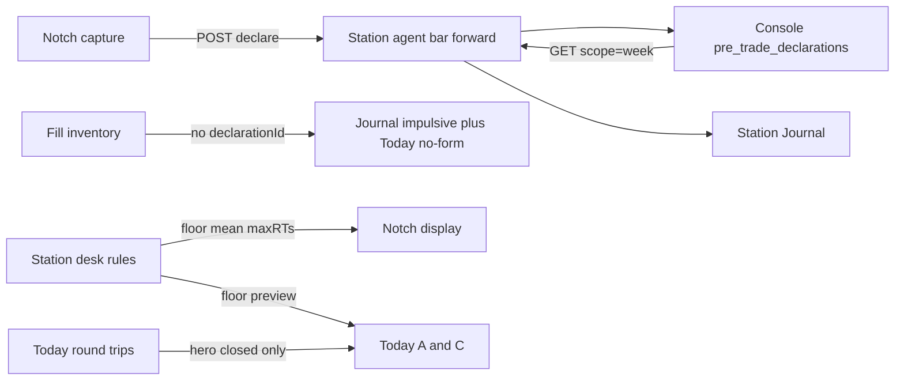

# Plan: Journal, then Settings, then Today 1–14

Source: `station/prototypes/PROTOTYPE-today-one-day.html` + J/S/1–14 lists already locked.
Layouts stay as the proto (Today A+C, Journal, Settings). **B is not a ship target.**

**Order is mandatory: Wave J → Wave S → Wave T.** Today remaining/floor needs Settings. Today “no form” and Journal impulsive share `declarationId`. Do not start T first.

Dual-cwd. Do not clone.

| Work | Path |
|------|------|
| Station | `/Users/bishnu/tradeautopsy-station` |
| Console | `/Users/bishnu/Tradeautopsy1/Untitled/tradeautopsy` |

## Architectural decisions

- **Sidebar destinations (proto):** Today · Journal · Backend Box · Settings. Capture stays Notch. Do not add Pre / Live / Post as Station tabs in these waves.
- **Journal: consume-only.** Notch is the only writer (`POST /api/bar/v1/declarations` already forwarded as `/api/daemon/bar/declare`). Station never authors a plan from Journal.
- **Declarations list:** new Station read `GET /api/daemon/bar/declarations?scope=week` forwards A8 Bearer to Console `GET /api/bar/v1/declarations`. Console today only has `scope=pending|recent` (limit 100) in `app/api/bar/v1/declarations/route.ts`. Wave J adds `scope=week` (local week, IST for India book) plus snapshot / notes / fidelity / day-sheet fields the proto paints. Do not invent a second table.
- **Statuses:** Console `pending | matched | cancelled | expired | superseded`. **Impulsive is Station-only** (fill/inventory with no `declarationId`). Not a Console enum.
- **Money:** Station Today owns desk P&L. Journal may show a matched net only by citing the Station trip. Console does not recompute FIFO onto the card. **DualNoBlend** if a rupee/dollar appears.
- **Settings floor ≠ Console `daily_loss_limit`:** Notch already has daily/weekly loss limits via `/api/daemon/bar/profile/loss-limits` (declare activation). Proto Daily floor / mean loss / max round trips are a Station desk-rules store that Notch displays. They do not POST loss-limits, do not fire Kill, are not T8 live.
- **Today layouts A/C ≠ RiskDeskMode:** Existing blotter / Notch-flip / tape stays. New `TodayLayoutMode`: `daySpine` (A) and `splitClocks` (C). Same payload.
- **Wave T money gate:** cite `issues/compliance/locks/binance-com-spot.md` and `issues/compliance/locks/kotak-nse-bse-cash.md`. Remaining is labeled T8 preview. No M1 cash WAC rewrite. No M3 flatten. No FO/NFO PnL owner. First-pair paint only (`binance_com` spot + `kotak_neo` cash). NIFTY in the proto is fixture.

---

## Wave J TDD seams (confirmed by this plan)

Tests live only at these public boundaries. No tests against internals.

1. **Console `GET /api/bar/v1/declarations?scope=week`** — IST week window for the India book, A8 Bearer, journal card fields from `pre_trade_declarations` (no second table, no FIFO net).
2. **Station agent `GET /api/daemon/bar/declarations?scope=week`** — forwards A8 Bearer to Console; Journal has no declare POST.
3. **Station `JournalWeek.build`** — week rail, facets, search, Due, impulsive from inventory with no `declarationId`; matched net only if a Station trip is cited.

---

## Wave J: all Journal (J1–J13) — one slice

Covers: J1–J13 in one demoable path.

### What to build

Replace the Journal placeholder in `station/StationApp/Views/StationShellView.swift` with the proto Journal: local week rail, day sheet, declaration cards, facets, search, drawer, impulsive section, Due badge, Make another → Notch, Export → Console markdown.

End-to-end: Notch already POSTs a declaration → Console stores frozen snapshot (s1 setup / invalidation / calm / confidence, SL consent, kind) → Station lists this Mac week → matched cards show pre / live / post and fidelity dims (consume Console, do not recompute) → fill with no `declarationId` appears under Impulsive → empty post sets Journal Due.

Console change is only what the list cannot already return: week scope + the fields the card/drawer needs (snapshot, match, notes, fidelity, day-sheet pin). Station agent adds GET forward next to existing POST declare in `agent/src/api/bar.rs`.

### Acceptance criteria

- [ ] Notch remains the only writer. Journal has no declare POST.
- [ ] Week list shows pending, matched, cancelled, expired (superseded = new declaration). Cancelled-before-fill and expired-unmatched stay on the sheet.
- [ ] Card snapshot: kind, setup, calm 1–5, confidence 1–5, SL, target, invalidation, SL consent, qty declared vs filled.
- [ ] Matched net, if shown, is Station trip P&L. DualNoBlend. Console does not recompute.
- [ ] Fidelity chips = process vs snapshot (entry / stop / target / size / inv). Impulsive has no fidelity. CTA = Plan in Notch.
- [ ] Facets: all / matched / pending / unmatched / post due / impulsive. Search over symbol, setup, emotion, invalidation.
- [ ] Day sheet pin + emotion for the selected local day. Older days stay Console.
- [ ] Shots / voice chips when Console has attachments. Export is Console markdown, not a second exporter.
- [ ] Sidebar Due when any matched row this week has empty post.
- [ ] A8 Bearer on the GET. Fail closed to honest empty, not invented rows.

---

## Wave S: all Settings (S1–S9) — one slice

Covers: S1–S9. Starts after Journal is demoable.

### What to build

Grow `station/StationApp/Views/SettingsView.swift` to the proto grouped form: General (launch at login keep; appearance = System), Risk limits (daily floor, mean loss, max round trips), Notch (hide + Open Notch), Privacy (API keys → Backend Box).

One Station desk-rules store. Notch reads the same three numbers for display only. Do not wire them to Kill. Do not POST `/api/daemon/bar/profile/loss-limits` from this page (that Console gate stays on Notch Risk tab).

### Acceptance criteria

- [ ] Launch at login unchanged.
- [ ] Appearance follows system. No third theme engine.
- [ ] Daily floor / mean loss / max round trips persist on this Mac and appear on Notch.
- [ ] Foot copy is law: these numbers do not fire Kill. Stop is Backend Box. Kill is Notch overlay.
- [ ] Hide Notch toggle matches existing HUD hide; ⌥Space still summons.
- [ ] Open Notch row opens the live circuit / declare / kill path.
- [ ] API keys row navigates to Backend Box broker card. No secrets in Settings.
- [ ] Patterns / escrow / fidelity stay Console — not added here.

---

## Wave T: Today spine 1–14 — one slice

Covers: shared spine 1–14 plus layouts A Day spine and C Split clocks, both kept. Starts after Settings (floor) and Journal (`declarationId`).

### What to build

One Today payload, two hierarchies. Extend `GET /api/daemon/today` + open inventory so both layouts can paint without a second owner.

- Hero = closed round trips only. Open MTM stays on the row (— until a lock owns it).
- Open book = second clock. Session date on the row → overnight tag. Fill inventory ≠ obtain.
- DualNoBlend from active shipping book. First-pair labels only.
- Intraday closed-P&L series vs Settings floor on the chart. Readout: closed · remaining-to-floor T8 preview · open MTM not on this line.
- Detect: planned SL vs live SL; no SL → do not invent a max; no `declarationId` → same impulsive as Journal.
- Deeper = Station inspector. Kill banner from agent/SSE projection (Y2), not Notch privates. Stop ≠ Kill.
- New layout switcher: A remaining+chart first; C split happened | now. Do not reuse `RiskDeskMode`.

D3 paste on the Today PR:

- Lock: `issues/compliance/locks/binance-com-spot.md` + `issues/compliance/locks/kotak-nse-bse-cash.md`
- Single owner: Station Today engine / payload (not Console, not Journal)
- Invariants kept: DualNoBlend · INR on IND · refuse FO/NRML on cash book · official rate · OPTIONS qty>1 (no new OPTIONS owner)

Out of this wave: M1 Kotak cash WAC rewrite, M3 flatten / max-loss kill, FO money, TradingView, blending closed+open MTM.

### Acceptance criteria

- [ ] A and C switch over the same payload. B not shipped.
- [ ] Hero closed-only. Open MTM never folded in. DualNoBlend.
- [ ] Overnight requires session date. Missing date → no overnight claim.
- [ ] Chart is this local day closed vs floor. Remaining on A is Settings floor minus closed used, labeled T8 preview.
- [ ] Detect uses real entry / planned SL / live SL / `declarationId`. No form = Journal impulsive.
- [ ] Deeper does not paint remaining-risk. Kill banner is projection. Limits still do not fire Kill.
- [ ] Quote is venue or labeled empty/—. No Yahoo × 0.99.
- [ ] Shipping paint: Kotak cash INR and Binance.com spot. Proto NIFTY/BANKNIFTY/FUT not claimed live.
- [ ] Open Notch CTA identical to Journal / Settings.
